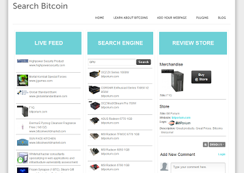

## Description

Web service for finding items that can be bought using Bitcoins. A Web crawler updates a sequel database with items it finds for sale. Old items are removed as they are taken offline. The database can easily be searched using a text query submitted. All querires are handled by a simple API. The homepage shows a running view of newly found items. 

## Download

* Download: [zip](https://github.com/jostmey/SearchBitcoin/zipball/master)
* Git: `git clone https://github.com/jostmey/SearchBitcoin`

## Setup

The frontend server can be found in the folder `searchbitcoin.com/`. Apache is used as the HTTP webserver, and the necessary files to configure the Apache server may be found in `searchbitcoin.com/config files/`. The website was constructed using a Content Management System called concrete5. The code implementing concrete5 may be found in `searchbitcoin.com/www/`, which has been configured to host the Search Bitcoin webpage. The Apache webserver expects the concrete5 files to be placed at `/var/www/`. The database for concrete5 runs on MySQL, and a copy has been saved in `searchbitcoin.com/concrete5 database/`.

The backend API is found in the folder `api.searchbitcoin.com/`. The backend consists of several compontents. The backend is structured around the SQL server (see ''api.searchbitcoin.com/nginx/databases' for the SQL tables), as three additional services handle administrative access, crawling the web, and the user API (for talking to the fronend). Administrative access is setup through Yii, a PHP framework (see 'api.searchbitcoin.com/nginx/www/backend'). The administrative panel allows for someone to add specific webpages to be searched by the web crawler, and to specific the CSS selectors used to extract data out of each website . The web crawler is written in Java and uses the package "crawler4j" (see 'api.searchbitcoin.com/nginx/www/JEngine'). The web crawler periodically searches specific websites parsing about the DOM of the webpages to extract specific data. Newly found items for sale are added to the database, and missing items are removed. Finally, an API provides public access to the service. The scripts are located in 'api.searchbitcoin.com/nginx/www/scripts/api', and the documentation on how to call the API is located in 'api.searchbitcoin.com/nginx/www/services'.

